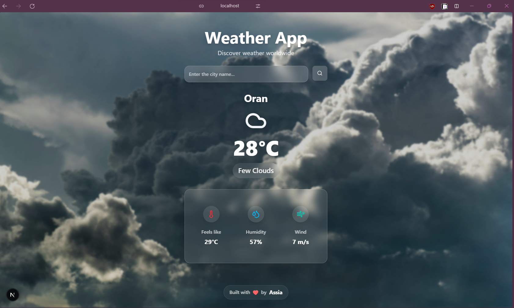

# 🌦️ Weather App

A modern weather application built with **Next.js 15** that provides real-time weather information with dynamic backgrounds and smooth animations.

<p align="center">  </p>

## ✨ Features

- 🔍 Search weather for any city worldwide
- 🌤️ Dynamic backgrounds that change based on weather conditions
- 📱 Responsive design for all devices
- 🎨 Modern glass-morphism UI with smooth animations
- ⚡ Real-time weather data with validation

## 🛠️ Tech Stack

- **Next.js 15** - React framework
- **TypeScript** - Type safety
- **Tailwind CSS** - Styling
- **shadcn/ui** - UI components
- **Framer Motion** - Animations
- **Zod** - Data validation
- **OpenWeather API** - Weather data

## 🚀 Getting Started

1. **Clone the repository**
   ```bash
   git clone https://github.com/tuba89/next-weather-app.git
   cd next-weather-app
   ```

2. **Install dependencies**
   ```bash
   npm install
   ```

3. **Set up environment variables**
   
   Create a `.env.local` file:
   ```env
   OPENWEATHER_API_KEY=your_api_key_here
   ```
   
   Get your free API key at [OpenWeatherMap](https://openweathermap.org/api)

4. **Run the development server**
   ```bash
   npm run dev
   ```

5. **Open [http://localhost:3000](http://localhost:3000)**

## 🌐 Deployment

Deploy easily on [Vercel](https://vercel.com/):
1. Push your code to GitHub
2. Import the repository on Vercel
3. Add your `OPENWEATHER_API_KEY` environment variable
4. Deploy!

## 📱 Usage

- Enter any city name in the search box
- Get real-time weather information including temperature, humidity, and wind speed
- Background automatically changes to match current weather conditions


## 🌐 Live Demo

👉 [View the Weather App here](https://next-weather-app-assia.vercel.app/)


## 🤝 Contributing

1. Fork the repository
2. Create your feature branch (`git checkout -b feature/amazing-feature`)
3. Commit your changes (`git commit -m 'Add amazing feature'`)
4. Push to the branch (`git push origin feature/amazing-feature`)
5. Open a Pull Request

---

## 👩‍💻 Author

Built with ❤️ by **Assia**

[](mailto:iiiassia.beniii@gmail.com)  
[](https://linkedin.com/in/assia-benkedia-20708195)


